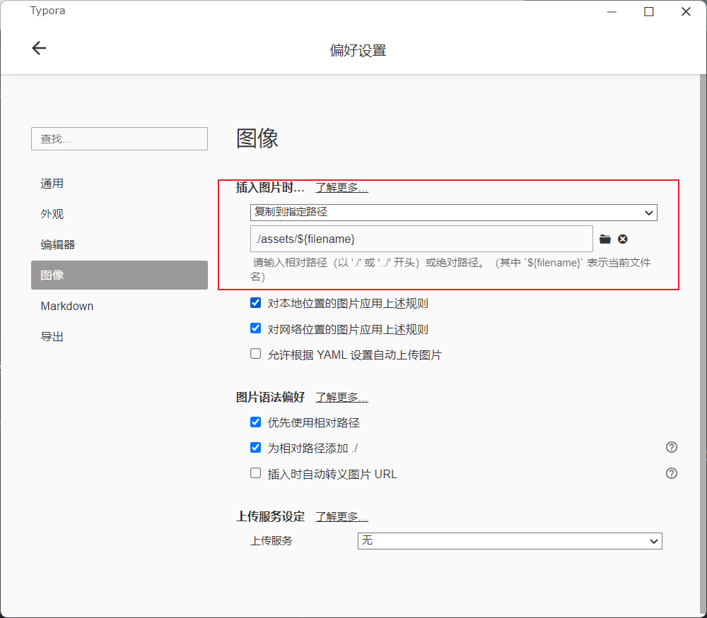
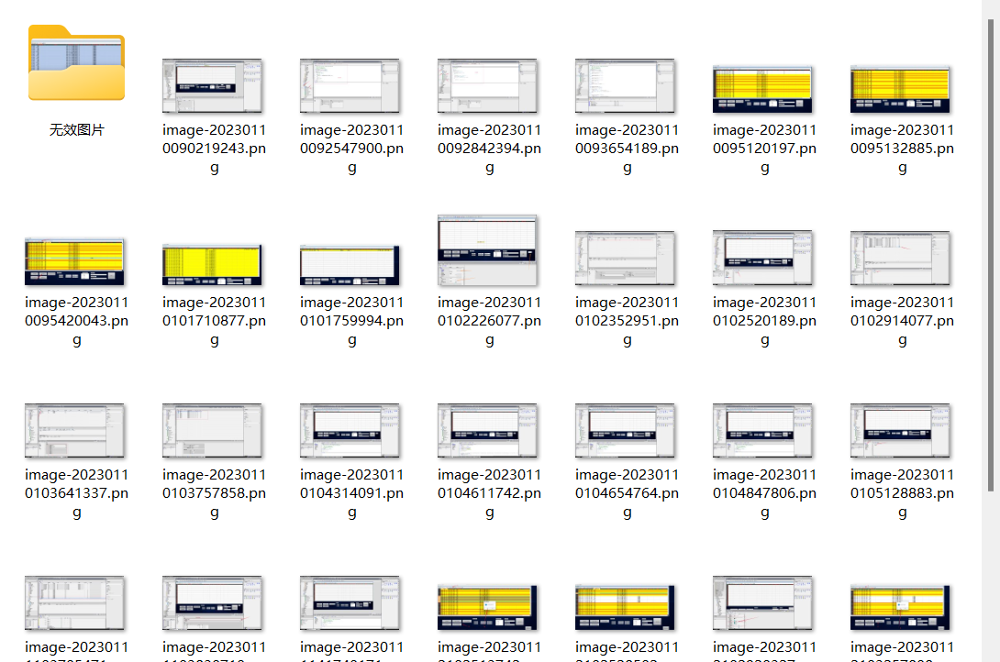
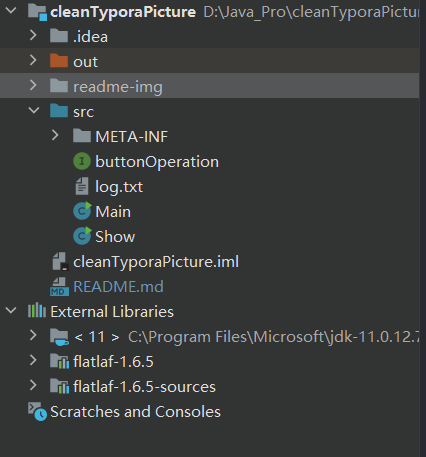
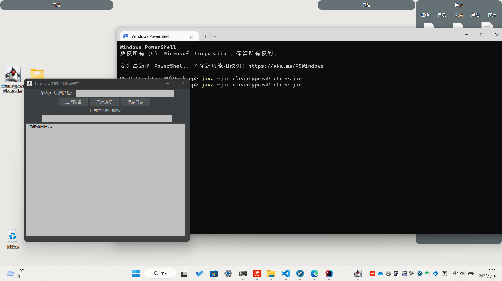

# cleanTyporaPicture
# 清理typora的无效图片
使用md在本地操作的朋友经常会碰见一下场景

就比如说我有一个md文档，里面涉及到引用图片了，但是我有的图片不满意，
我把引用图片删了，重新引用一个图片，但是删除的那个引用图片还是存在。
虽说占内存不算多，但是对于一个对文件管理强迫症的人来说，是非常难受的了。
此工具就是清除那些无效的图片来解决的

## 操作设置
在typora里面点击
**偏好设置——图像——插入图片——复制到指定路径**

**图片保存路径**设置为`./assets/${filename}`

对应的文件保存格式也一定要按照这种格式，这是我的操作习惯，所以就这么写了。
之后可以添加个选项模式对应不同的操作习惯。

## 整体思路
扫描该路径下的所有md文档，一定只存md文档，之前操作的时候，没存md文档会报错
但是添加约束之后，发现md后缀我的操作有全角半角的区别，导致识别的很麻烦，
所以程序约束难就对自己约束一点，哈哈

之后会打开assets文件夹，扫描assets文件夹下面所有文件夹，文件夹名称和md
文档名称相对应

找出无效图片，并且新建无效图片文件夹，放到里面，这样我就可以看到有
哪些图片没有用到了，然后根据自己的需求进行删除。

## 结构

**show.java为gui界面** 
使用了JFrame类作为主要显示，引入第三方美化界面flatlaf的类库

**Main.java为执行操作的主体程序** 

**buttonOperation 为gui界面按钮事件监听的操作主体程序**

## 界面预览
